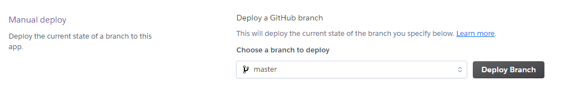
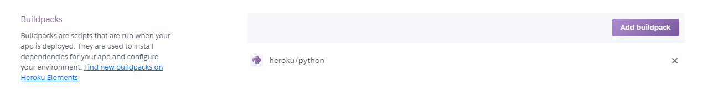
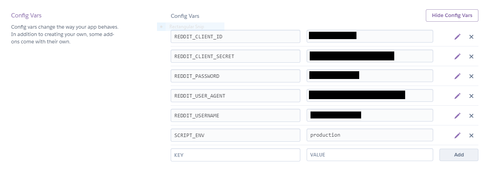
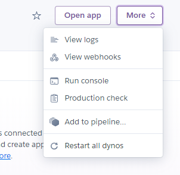

# Reddit Notification Bot

This bot is a configurable bot to notify redditors when a keyword is posted in a desired subreddit. It supports keywords, blacklisted keywords, and messaging multiple users per subreddit.

RNB is designed to be hosted both locally and on Heroku.

# Local Installation

Local installation of RNB requires 2 config files, `config.json` and `env.py`. If this is your first time using RNB, you'll notice that the `config.json` file already exists, but `env.py` does not -- This is because sensitive credentials live in this file that should not be committed to source control.

There is an install script to copy a template to the correct location:

```
sh install.sh
```

This will install the correct `env.py` and you can configure it with the correct credentials.

### `config.json`

For this file, you'll need to add subreddits. A basic configuration might look like this:

```json
{
  "test": {
    "keywords": [
      "test"
    ],
    "blacklisted_keywords": [
      "bot"
    ],
    "redditors": [
      "pawptart"
    ]
  }
}
```

This configuration will send a message to `/u/pawptart` every time a submission to `/r/test` includes `test` but not `bot`. You can add an arbitrary number of subreddits, keywords, blacklists, and redditors:

```json
{
  "test": {
    "keywords": [
      "keyword1",
      "keyword2",
      "keyword3",
      "keyword4",
      "keyword5"
    ],
    "blacklisted_keywords": [
      "blacklisted_keyword1",
      "blacklisted_keyword2",
      "blacklisted_keyword3",
      "blacklisted_keyword4",
      "blacklisted_keyword5"
    ],
    "redditors": [
      "test_redditor_1",
      "test_redditor_2"
    ]
  },
  "requestabot": {
    "keywords": [
      "keyword1",
      "keyword2",
      "keyword3",
      "keyword4",
      "keyword5"
    ],
    "blacklisted_keywords": [
      "blacklisted_keyword1",
      "blacklisted_keyword2",
      "blacklisted_keyword3",
      "blacklisted_keyword4",
      "blacklisted_keyword5"
    ],
    "redditors": [
      "test_redditor_1",
      "test_redditor_2"
    ]
  }
}
```

These configurations would message 2 separate users for every keyword trigger.

# Heroku Deployment

To host on Heroku, you'll need to edit the JSON configuration as above and commit it to the repo:

```bash
git add config.json
git commit -m "Update config.json"
git push origin HEAD
```

Next, you'll need to connect your GitHub account to your Heroku account first, then create a new app.

Within the app, you'll need to connect to the RNB repository (you can search for `Reddit-Notification-Bot`). Then, manually deploy the `master` branch (you can configure auto-deploy if you like that option in the same way):



Add a buildpack so that Heroku knows to run a Python script:



Finally, update your config vars. **These are the same variables you see in `env.py.example`, but you'll have to enter them manually.** You also should set an additional variable, `SCRIPT_ENV`, to `production`.



That's it! Your bot should be deployed correctly with the script running as you've configured it. If you ever need to update the configuration, you can repeat the above step:

```bash
git add config.json
git commit -m "Update config.json"
git push origin HEAD
```

If you didn't set up auto-deploy, you'll also have to manually deploy the `master` branch again.

# Troubleshooting

You may need to kick off the worker dyno the first time to get it started:



Go to the Heroku console by clicking `Run console`, and in the terminal where `heroku run` appears, you can type: 

```bash
python bot.py
```

to start the worker dyno. Your logs should also appear here as well.